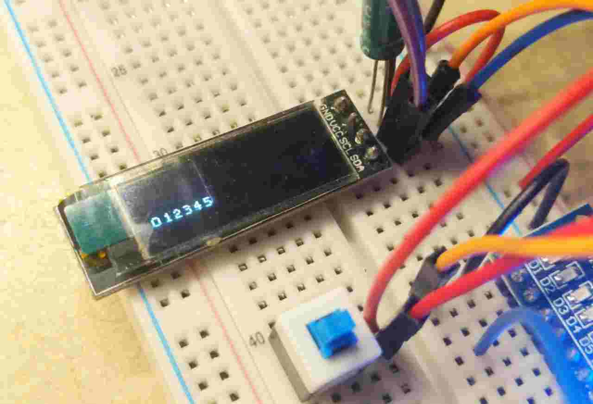

# SSD1306 screen handling with plain RISC-V assembly

This is an attempt to handle a SSD1306 screen driver using a CH32V003, a RISC-V based
microcontroller.




## Requirements

```
apt-get install gcc-riscv64-unknown-elf
```

- [minichlink](https://github.com/cnlohr/ch32fun/blob/master/minichlink/README.md)

## Makefile

- `make` to build.
- `make flash` to build and flash.
- `make server` to start a gdb server.
- `make gdb` to start a debugging session.
